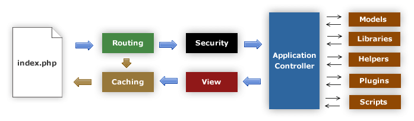
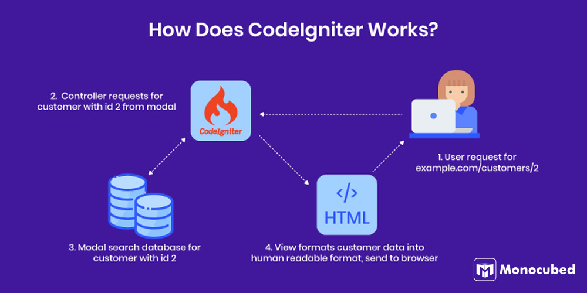

# 220302040 Muhammad Hassan Thalib

Playground project dengan menggunakan CodeIgniter 4. Sebagian langkah pengerjaan dijelaskan pada notion [berikut ini](https://silent-sphere-b78.notion.site/Code-Igniter-4-20ea1b48d23b4a84afe903ca261d2667?pvs=4)

## Overview
CodeIgniter merupakan FullStack Web App Framework yang pada bahasa pemrograman PHP.

## Persyaratan
- PHP ver 8.1.10+
- Composer ver 2.5.5+
- PostgreSQL ver 16.2+

## Instalasi
### Manual
[Download](https://github.com/muhammadhassan3/ci-example/archive/refs/heads/master.zip) project dan extract file unduhan tersebut
### Git Clone
Jalankan perintah berikut pada direktori tempat project akan diletakkan

```shell 
git clone https://github.com/muhammadhassan3/ci-example.git
```

## Menjalankan project
Untuk menjalankan project, buka direktori project pada terminal dan jalankan perintah berikut ini. Aplikasi akan secara default berjalan pada port 8080

```shell
php spark serve
```

Untuk menentukan port yang digunakan aplikasi, tambahkan argument `--port`

```shell
php spark serve --port 80
```

## Arsitektur
### Alur Proses


Proses penanganan *request* pada CodeIgniter4 adalah pertama kali pengguna melakukan *request* maka CodeIgniter akan mengembalikan halaman yang sudah ter-*cache* sebelumnya apabila tersedia. Apabila halaman yang diminta tidak tersedia pada cache, permintaan akan langsung ditangani oleh controller dan mengembalikan view sesuai dengan permintaan pengguna serta melakukan penyimpanan cache apabila dibutuhkan.
### Architecture Pattern


Pada CodeIgniter menggunakan jenis *Architecture pattern* MVC dimana terdapat komponen Model, View, dan Controller. Berikut beberapa penjelasan dari komponen tersebut.
#### Model
Komponen model bertanggung jawab untuk melakukan komunikasi dengan media penyimpanan data, baik memuat data ataupun melakukan manipulasi data.
#### View
Komponen view bertanggung jawab untuk menampilkan data atau halaman kepada pengguna. Komponen view ini berisikan baris kode HTML, CSS, Javascript adn sedikit kode PHP.
#### Controller
Komponen controller bertanggung jawab untuk melakukan proses pengolahan data sebelum digunakan oleh model, baik melalui proses validasi ataupun error handling. Komponen ini juga bertanggung jawab untuk mengatur laju proses yang dieksekusi.

## Konfigurasi Dasar
Konfigurasi dasar dilakukan pada file `.env`
### Menentukan Base URL
Base URL akan digunakan pada saat sistem melakukan pengalihan.
```
app.baseURL = 'http://localhost:8080/'
```

### Konfigurasi database
Lakukan konfigurasi database untuk menghubungkan aplikasi dengan database

```
database.default.hostname = localhost
database.default.database = movies
database.default.username = postgres
database.default.password = root
database.default.DBDriver = Postgre
database.default.port = 5432
```
### Konfigurasi Environment
Pada CodeIgniter4 mendukung 3 jenis environment. yaitu `development`, `testing`, dan `production`. Setiap environment memiliki tujuan tersendiri yaitu :
#### Development
pada environment ini segala fitur yang mendukung proses pengembangan sistem, seperti debugging dan logging.
#### Testing
Pada environment ini dikhususkan untuk proses pengujian menggunakan PHPUnit.
#### Production
Pada environment ini dikhususnya untuk proses deployment sehingga akan mengurangi beberapa berkas yang tidak diperlukan sehingga ukuran dari berkas aplikasi akan menjadi lebih kecil.


Untuk menentukan environment yang akan digunakan, tetapkan nilai pada property `CI_ENVIRONMENT`

```
CI_ENVIRONMENT = [development | testing | production]
```
## Routes
Untuk menentukan route yang digunakan pada aplikasi, letakkan routes pada file `App/Config/Routes.php`. Pada project ini, terdapat beberapa contoh routes.
### Get Method
Rute ini bertujuan untuk menangani permintaan get yang digunakan browser saat mengakses endpoint. Routes ini akan memanggil fungsi index yang ada pada kelas Movies dan menambahkan alias pada route.
```
$routes->get('/movie', 'Movies::index', ['as' => 'movie']);
```

### Post Method
Rute ini bertujuan untuk menangani permintaan POST yang dilakukan browser, method post ini biasanya digunakan untuk melakukan proses penambahan data. Rute berikut ini akan memanggil fungsi add yang ada pada klas Movies.
```
$routes->post('/movie', 'Movies::add');
```

### Put Method
Rute ini bertujuan untuk menangani permintaan PUT yang biasanya dilakukan oleh AJAX, REST, ataupun CURL. Hal ini disebabkan karena browser tidak mendukung metode permintaan lain selain GET dan POST. Metode PUT biasanya digunakan untuk melakukan perubahan pada data yang ada pada database. Route ini akan memanggil fungsi put yang ada pada kelas Home.
```
$routes->put('/put', [Home::class, 'put']);
```

### Delete Method
Rute ini bertujuan untuk menangani permintaan DELETE yang biasanya dilakukan oleh AJAX, REST, ataupun CURL. Hal ini disebabkan karena browser tidak mendukung metode permintaan lain selain GET dan POST. Metode DELETE biasanya digunakan untuk melakukan penghapusan data yang ada pada database. Route ini akan memanggil fungsi delete yang ada pada kelas Home.
```
$routes->delete('/delete', [Home::class, 'delete']);
```

### Grouping Route
Grouping Route dilakukan untuk mengelompokkan route sehingga dapat lebih mudah dibaca dan di-*maintain*. Berikut merupakan pengelompokan route yang ada pada project.
```
$routes->group('movie', static function ($routes) {
    $routes->get('', 'Movies::index', ['as' => 'movie']);
    $routes->get('parser', [Movies::class, 'getAllWithParser']);
    $routes->get('table', [Movies::class, 'showTable']);
    $routes->get('create', 'Movies::create');
    $routes->post('', 'Movies::add');
    $routes->get('ex', [Movies::class, 'exception']);
    $routes->get('custom-response', [Movies::class, 'customResponse']);
    $routes->get('redirect', [Movies::class, 'redirect']);
    $routes->get('(:segment)', [Movies::class, 'show']);
    $routes->post('(:num)', [Movies::class, 'update']);
    $routes->get('(:segment)/(:num)', [Movies::class, 'show']);
});
```

### Resources Route
Pendeklarasian ini dilakukan untuk membuat **segala jenis** route yang ada. Pada project ini, terdapat deklarasi resource root.
```
$routes->resource('/api', ['controller' => 'Rest']);
```
Pendeklarasian route di atas akan membuat beragam jenis route dengan awalan `/api` yang merujuk pada controller kelas Rest. Berikut beberapa route yang otomatis dibuat.
```
$routes->get('api/new', 'Rest::new');
$routes->post('api', 'Rest::create');
$routes->get('api', 'Rest::index');
$routes->get('api/(:segment)', 'Rest::show/$1');
$routes->get('api/(:segment)/edit', 'Rest::edit/$1');
$routes->put('api/(:segment)', 'Rest::update/$1');
$routes->patch('api/(:segment)', 'Rest::update/$1');
$routes->delete('api/(:segment)', 'Rest::delete/$1');
```

## Model
Model merupakan sebuah komponen yang akan melakukan proses transaksi dengan media penyimpanan data. Model ini biasanya berkaitan dengan proses *migration* yang dilakukan. Pada project ini terdapat 2 kelas Model, namun hanya 1 yang digunakan yaitu kelas MovieModel. Kelas Model diharusnya untuk menurunkan kelas `CodeIgniter\Model` supaya dapat digunakan dengan baik.
```
class MovieModel extends Model
{
    protected $table = 'movie';

    protected $allowedFields = ['title', 'description'];

    public function getAll($title = "")
    {
        if ($title === '') {
            return $this->findAll();
        }

        return $this->where(['title' => $title])->first();
    }
}
```

Method `$table` digunakan untuk mendefinisikan nama tabel yang ada pada database. Serta fungsi `getAll()` dengan parameter `$title` yang memiliki default argument `""` berfungsi untuk memuat seluruh data yang ada pada tabel movie.

##View
View merupakan komponen yang ebrtanggung jawab dalam menampilkan data kepada pengguna. Komponen view ini biasanya terdapat pada direktori `App\View`. Pada project ini, terdapat beberapa jenis view, serta template yang dapat digunakan secara berulang.
#### template/header.php
```
<!doctype html>
<html>
<head>
    <title>CodeIgniter Tutorial</title>
</head>
<body>
    <h1><?= esc($title)?></h1>
```
Pada komponen header akan menggunakan dynamic value pada variable `$title` sehingga konten pada komponen view ini dapat berubah-ubah bergantung dengan nilai yang ditetapkannya. 

#### template/footer.php
```
    <em>&copy; 2022</em>
</body>
</html>
```
Pada komponen footer ini akan digunakan untuk menampilkan *copyright* text pada bagian bawah halaman
#### movies/index.php
```
<h2><?= esc($title) ?></h2>

<?php if (! empty($list) && is_array($list)): ?>

    <?php foreach ($list as $item): ?>

        <h3><?= esc($item['title']) ?></h3>

        <div class="main">
            <?= esc($item['description']) ?>
        </div>
        <p><a href="/movie/<?= esc($item['title'], 'url') ?>">View article</a></p>

    <?php endforeach ?>

<?php else: ?>

    <h3>No News</h3>

    <p>Unable to find any news for you.</p>

<?php endif ?>
```

Pada komponen ini akan digunakan untuk menampilkan data yang ada pada database, menggunakan perulangan untuk melakukan iterasi pada setiap item yang ditetapkan pada controller.

#### Menggunakan View
Untuk menggunakan komponen view dapat dilihat pada berkas `App\Controllers\Movies.php`
```
public function index()
    {
        $data['list'] = $this->movieModel->getAll();
        $data['title'] = 'Movie List';
        return view('template/header', $data)
            . view('movies/index')
            . view('template/footer');
    }
```

Pada fungsi `index()` yang ada pada class Movies mengembalikan gambungan dari komponen view header, index, dan footer. Serta menambahkan argument kedua pada pemanggilan fungsi pertama. Argument yang diberikan memiliki tipe data array dengan setiap elemen yang memiliki keyword sama dengan yang ada pada komponen view. Hal ini bertujuan supaya setiap *placeholder* yang ada pada berkas View akan digantikan oleh nilai yang ada didalam array `$data` dengan keyword yang sama.

## Controller
Kelas Controller bertanggung jawab dalam mengelola dan melakukan processing terhadap permintaan yang masuk. Proses validasi juga dilakukan pada komponen ini sehingga data yang digunakan pada model, merupakan data yang valid. Setiap kelas pada Controller harus melakukan penurunan salah satu kelas BaseController, Resources, atau Controller sehingga dapat dikenali oleh Route. Berikut merupakan contoh kelas controller yang ada pada project ini.
```
class Movies extends BaseController
{
    private $movieModel;

    public function __construct()
    {
        //create new instance or get shared instance
        $this->movieModel = Factories::models('MovieModel');

        //menggunakan helper form untuk memproses data yang dikirimkan
        helper('form');
    }

    public function add()
    {
        $data['title'] = 'Tambahkan data';

        $data = $this->request->getPost(['title', 'description']);

        if (!$this->validateData($data, [
            'title' => 'required|max_length[50]|min_length[3]',
            'description' => 'required|min_length[4]'
        ])) {
            return $this->create();
        }

        $post = $this->validator->getValidated();

        $this->movieModel->save([
            'title' => $post['title'],
            'description' => $post['description'],
        ]);

        return view('template/header', ['title' => 'Tambahkan data movie'])
            . view('movies/sucess')
            . view('template/footer');
    }
}

```

Pada kelas Movies dan method `add()` terdapat proses validasi sebelum menyimpannya pada database menggunakan model saat menangani permintaan POST yang diteruskan Router. Setelah proses selesai dan berhasil akan mengembalikan pesan sukses pada pengguna.
